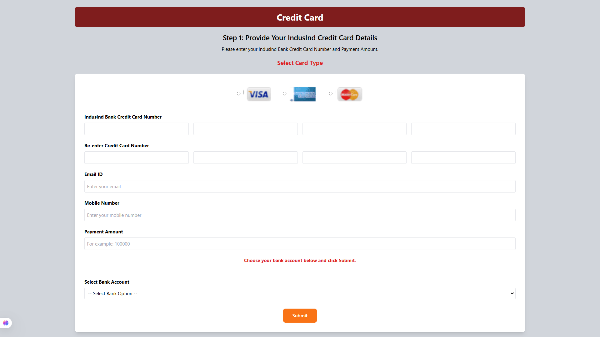

# Day-04 Tailwind CSS - IndusInd Credit Card Payment Form

## 📌 Description

Built a responsive IndusInd Bank Credit Card Payment Form using HTML5 and Tailwind CSS.

This project focuses on creating a clean payment form with card selection, customer details, payment amount, and bank account selection using Tailwind utility classes.

---

## 🛠️ Technologies Used

- HTML5
- Tailwind CSS

---

## 📚 Tailwind CSS Concepts Covered

- Utility Classes
- Background Colors
- Text Colors
- Typography
- Width and Height
- Margin and Padding
- Border and Border Radius
- Flexbox
- Responsive Layout
- Form Styling
- Buttons Styling

---

## ✨ Features

- Credit Card Selection
- Visa, Mastercard and RuPay Cards
- Credit Card Number Input
- Confirm Card Number
- Email Address
- Mobile Number
- Payment Amount
- Bank Account Dropdown
- Submit Button
- Responsive Design

---

## 📁 Project Structure

```text
Day-04-Tailwind-IndusInd-Credit-Card-Payment/
│
├── index.html
├── src/
│   ├── visa.png
│   ├── mastercard.png
│   └── rupay.png
├── Output_Screenshots/
│   ├── Output.png
└── README.md
```

---

## 📸 Output



---

## 🎯 Learning Outcome

This project helped me understand how to build responsive payment forms using Tailwind CSS utility classes. I learned to style forms, arrange elements using Flexbox, and create modern user interfaces without writing custom CSS.

---

## ⚠️ Note

This project is created only for learning and practice purposes. It is not an official IndusInd Bank payment portal.